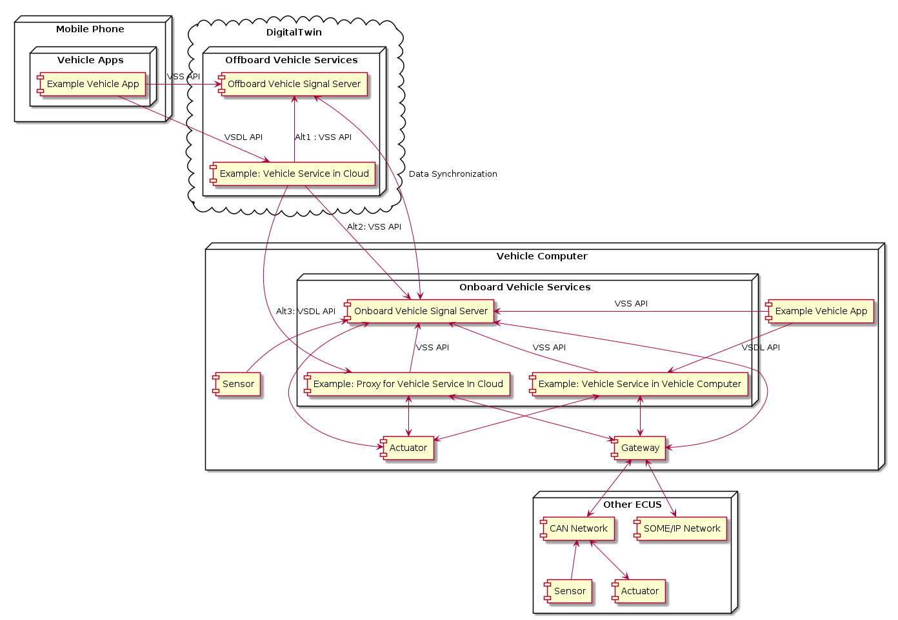
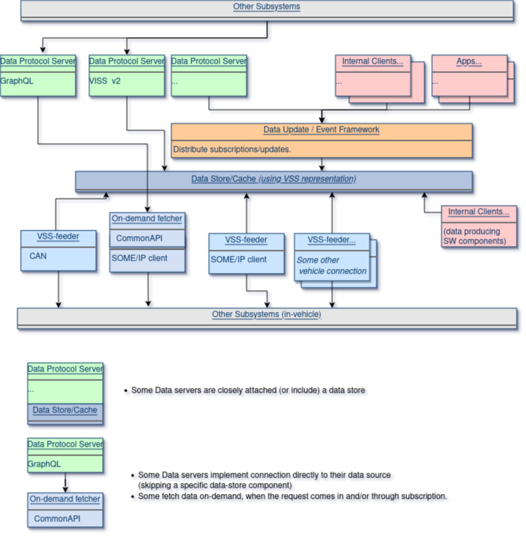

# COVESA Vehicle Data Solution Overview

## Terms and Definitions

## Terms and Components

### Vehicle Signal Specification (VSS)

VSS can refer to either the catalog of signal defined by the [COVESA VSS project](https://github.com/COVESA/vehicle_signal_specification)
or the metamodel/syntax used to define VSS-like signals. VSS is in itself not an API and does not specify what API to use to access VSS data.

### VSS-like Signals

This term refers to signals not being part of the Vehicle tree in the COVESA Vehicle Signal Specification but defined with the VSS metamodel.
Tooling and APIs for VSS can in many cases also be used for VSS-like signals as they are defined using the same VSS metamodel.

### Attribute

Attribute is one of three signal types defined by the VSS metamodel. An attribute is a datapoint that is constant over time or does not change frequently.
It can typically not be set by Vehicle Applications.
Typical examples could be Vehicle Identification Number (VIN) and Vehicle Color Code.

### Sensor

Sensor is one of three signal types defined by the VSS metamodel. A sensor is a datapoint that may change frequently.
It can typically not be set by Vehicle Applications.
Typical examples could be Vehicle Speed and Engine Temperature.

### Actuator

Actuator is one of three signal types defined by the VSS metamodel. An actuator is a datapoint that contains the wanted/target value, but may also contain the actual value.
Vehicle applications can typically set the wanted/target value of an Actuator.
The actual value, like for sensors, may change frequently.
A typical example could be the position for a window. A Vehicle App may set the wanted position, while the actual actuator reports current value.

### Vehicle Service

A Vehicle Service is a functionality deployed either onboard or offboard, offering services to clients deployed either onboard or offboard.

### Vehicle Application

A Vehicle Application is an onboard client interacting with Vehicle Services.

### Vehicle Signal Server

A Vehicle Signal Server is a Vehicle Service that provides access to VSS-signals or VSS-like signals.
It typically provide get/set/subscribe-operations that clients including Vehicle Applications can use to access VSS data.

Existing or planned implementations include:

* [KUKSA.val](https://github.com/eclipse/kuksa.val)
* [W3C VISS reference implementation](https://github.com/w3c/automotive-viss2)
* [Eclipse Ibeji](https://projects.eclipse.org/proposals/eclipse-ibeji)

A Vehicle Signal Server may be deployed Onboard or Offboard.

### Digital Twin

A Digital Twin is a "digital copy" of a Vehicle. It can either simulate core functionality of a vehicle, or use synchronization to keep the Vehicle and the Digital Twin equal.
Offboard Clients may interact with the Vehicle Signal Server and Vehicle Services in the Digital Twin rather than the "real" Vehicle Signal Server or Vehicle Service deployed onboard.
This allows the client to read or write vehicle data even if the vehicle is offline, and it hides the actual communication protocol used between Vehicle and Cloud.

### Gateway

A Gateway is a connector between Vehicle Services and other ECUs. It may be specific to a certain transport protocol, like CAN or SOME/IP.
For a Vehicle Signal Server the role of the gateway is to forward set-requests and read-requests to the other ECU,
and in the other direction consume data and feed as actual values for VSS signals to the Vehicle Signal Server.
For a Vehicle Service which is not a Vehicle Signal Server the role of a Gateway is to forward method calls and return responses for the Vehicle Service.

Existing implementations of Gateways include:

* [KUKSA.val CAN/DBC feeder](https://github.com/eclipse/kuksa.val.feeders/tree/main/dbc2val)
* [KUKSA.val GPS feeder](https://github.com/eclipse/kuksa.val.feeders/tree/main/gps2val)
* [KUKSA.val SOME/IP feeder](https://github.com/eclipse/kuksa.val.feeders/tree/main/someip2val)

### VSS API

VSS API refers to an API that is used to access a Vehicle Signal Server. The API may be intended to be used by clients (e.g. Vehicle Applications) only, or it may also offer functionality that Sensors and Actuators can use to subscribe to wanted value and report actual value.

Current implementations include:

* Vehicle Information Service Specification (VISS) [Core](https://raw.githack.com/w3c/automotive/gh-pages/spec/VISSv2_Core.html] and [Transport](https://raw.githack.com/w3c/automotive/gh-pages/spec/VISSv2_Transport.html) specifications specifying HTTPS, WebSocket and MQTT interface
* [KUKSA.val](https://github.com/eclipse/kuksa.val) specifying a gRPC interface

### Service Interface Definition Language (IDLs)

A Service Interface Definition Language is used to define methods (and event and attributes) that a client can use to interact or get information from a (Vehicle) Service.

Possible IDLs to use for vehicle services include:

* [COVESA Vehicle Service Definition Language](https://github.com/COVESA/vehicle_service_catalog/blob/master/syntax.md), part of VSC
* [Franca IDL](https://github.com/franca/franca)
* [BAMM Apect Meta Model](https://openmanufacturingplatform.github.io/sds-bamm-aspect-meta-model/bamm-specification/snapshot/index.html)
* [Digital Twin Definition Language(DTDL)](https://learn.microsoft.com/en-us/azure/digital-twins/concepts-models)

### COVESA Vehicle Service Definition Language

The [COVESA Vehicle Service Definition Language](https://github.com/COVESA/vehicle_service_catalog/blob/master/syntax.md) is a YAML-based syntax to define
vehicle services. It is part of the COVESA Vehicle Service Catalog project.

### COVESA Vehicle Service Catalog (VSC)

The [COVESA Vehicle Service Catalog](https://github.com/COVESA/vehicle_service_catalog) is a COVESA project consisting of the following parts:

* The [COVESA Vehicle Service Definition Language](https://github.com/COVESA/vehicle_service_catalog/blob/master/syntax.md)
* A catalog of standardized services, currently only consisting of an [example service](https://github.com/COVESA/vehicle_service_catalog/blob/master/comfort-service.yml) for controlling seats
* [Tooling](https://github.com/COVESA/vsc-tools) to convert VSC definitions to other Service Interface Definition Languages, Like BAMM, DTDL and Protobuf.

## Deployment overview

The picture below shows a possible deployment scenario 

Or instead using the picture from [CVII Wiki](https://wiki.covesa.global/display/WIK4/CVII+Tech+Stack).

